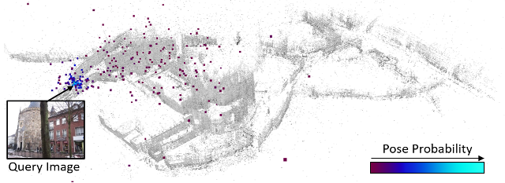
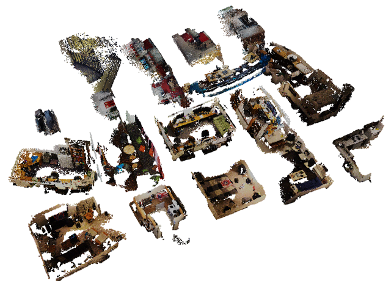
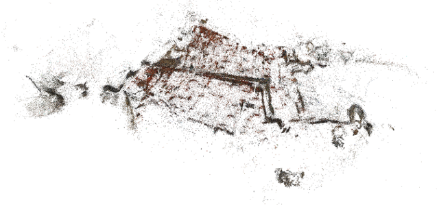
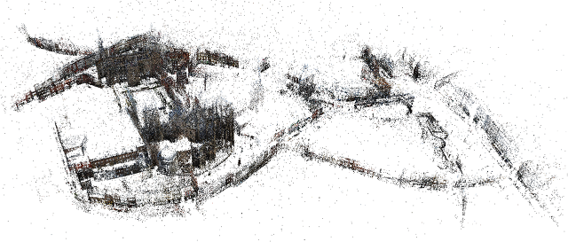

# ESAC - Expert Sample Consensus Applied To Camera Re-Localization

- [Introduction](#introduction)
- [Installation](#installation)
- [Code Structure](#code-structure)
- [Data Structure](#data-structure)
    - [Environments](#environments)
    - [Dataset Classes](#dataset-classes)
    - [Emulating DSAC++](#emulating-dsac)
- [Supported Datasets](#supported-datasets)
    - [7/12/19 Scenes](#71219-scenes)
    - [Dubrovnik](#dubrovnik)
    - [Aachen Day/Night](#aachen-daynight)
- [Training ESAC](#training-esac)
- [Testing ESAC](#testing-esac)
- [Publication](#publication)

## Introduction



Expert Sample Consensus (ESAC) is a method to fit a parametric model to an observation.
In particular, this code fits the absolute 6D camera pose (the parametric model) to an RGB image (the observation).
ESAC can be trained for a large, complex environment, and is then able to re-localize within this environment given a single image.
ESAC relies on ensemble of expert networks where each expert specializes to one part of the environment. 
A gating network decides which expert is responsible for a given input image.

ESAC builds upon [Scene Coordinate Regression](https://ieeexplore.ieee.org/document/6619221) and [differentiable RANSAC (DSAC)](https://arxiv.org/abs/1611.05705), in particular it extends our previous re-localization pipeline, [DSAC++](https://github.com/vislearn/LessMore), and makes it scalable.

Please refer to the [ESAC paper](https://arxiv.org/abs/1908.02484) for a detailed, and formal description of the method. You find a bibtex reference of the paper at the end of this readme.

## Installation

ESAC is based on PyTorch, and includes a custom C++ extension which you have to compile and install (but it's easy). The main ESAC framework is implemented in Python, including data processing and setting parameters. The C++ extension encapsulates robust pose optimization and the respective gradient calculation for efficiency reasons.

ESAC requires the following python packages, and we tested it with the package version in brackets.
```
pytorch (1.2.0)
opencv (3.4.2)
scikit-image (0.15.0)
```
You compile and install the C++ extension by executing:

```bash
cd code/esac
python setup.py install
```
Compilation requires access to OpenCV header files and libraries. If you are using Conda, the setup script will look for the OpenCV package in the current Conda environment. Otherwise (or if that fails), you have to set the OpenCV library directory and include directory yourself by editing the setup.py file.

If compilation succeeds, you can `import esac` in your python scripts. The extension provides two functions: `esac.forward(...)` and `esac.backward(...)`. Check our python scripts or the documentation in `esac.cpp` for reference how to use these functions.

## Code Structure

This repository contains:

-------

`code/`  
&nbsp; &nbsp; `esac/` -- folder contains the ESAC C++ extension  

&nbsp; &nbsp; `gating.py` -- gating network architecture  
&nbsp; &nbsp; `expert.py` -- expert network architecture for scene coordinate regression  
&nbsp; &nbsp; `expert_ensemble.py` -- ESAC ensemble class (gating + multiple experts)  

&nbsp; &nbsp; `init_gating.py` -- initialize the gating network by training it for classification  
&nbsp; &nbsp; `init_expert.py` -- initialize an expert network with ground truth scene coordinates    
&nbsp; &nbsp; `ref_expert.py` -- refine an expert network by minimizing the reprojection error  

&nbsp; &nbsp; `train_esac.py` -- train an ESAC ensemble end-to-end (see Eq. 3.3 of the paper)  
&nbsp; &nbsp; `test_esac.py` -- test an ESAC ensemble  

&nbsp; &nbsp; `room_dataset.py` -- dataset class for pre-clustered environments  
&nbsp; &nbsp; `cluster_dataset.py` -- dataset class for connected environments (does kMeans clustering)  
&nbsp; &nbsp; `util.py` -- collection of utility functions   

`datasets/`  
&nbsp; &nbsp; `setup_7scenes.py` -- script downloads and converts 7Scenes (MSR)  
&nbsp; &nbsp; `setup_12scenes.py` -- script downloads and converts 12Scenes (Stanford)  
&nbsp; &nbsp; `setup_dubrovnik.py` -- script converts the Dubrovnik6k dataset (Cornell)  
&nbsp; &nbsp; `setup_aachen.py` -- script downloads and converts Aachen Day/Night (Sattler)

`environments/`  -- folder to run experiments in, contains scripts to download pre-trained models

`README.md` -- this documentation  

-------
The core of the code are the scripts `train_esac.py` and `test_esac.py`. The exact [training](#training-esac) and [testing](#testing-esac) procedure will be discussed below.
ESAC is trained for a specific `environment` which consists of a combination of datasets from the `datasets` folder. For example, for the 19Scenes environment discussed in the paper, we combine the 7Scenes and 12Scenes datasets. We explain the details of the data setup next.

## Data Structure

The `datasets` folder is expected to contain one sub-folder per self-contained scene (e.g. one indoor room or one outdoor area).
Individual scenes will be combined to complex indoor or outdoor environments within the `environments` folder where the actual experiments run. 
An environment references data lying in the `datasets` folder.
We do not provide any data with this repository.
However, the `datasets` folder comes with a selection of Python scripts that will download and setup the datasets used in our paper.
In the following, we describe the data format expected in each scene folder, but we advice to look at the provided dataset scripts for reference.

Each sub-folder of `datasets` should be structured by the following sub-folders that implement the training/test split expected by the code:

`datasets/<scene_name>/training/`  
`datasets/<scene_name>/test/`  

Training and test folders contain the following sub-folders:

`rgb/` -- image files  
`calibration/` -- camera calibration files  
`poses/`  -- camera transformation matrix   
`init/` -- (training only) ground truth scene coordinates  

Correspondences of files across the different sub-folders will be established by alphabetical ordering.

**Details for image files**: Any format supported by `scikit-image`.

**Details for calibration files**: Text file. Contains 4x4 matrix following the 7Scenes/12Scenes coordinate convention.  

**Details for calibration files**: Text file. At the moment we only support the camera focal length (one value shared for x- and y-direction, in px). The principal point is assumed to lie in the image center.

**Details for init files**: (3xHxW) tensor (standard PyTorch file format via `torch.save`/`torch.load`) where H and W are the dimension of the *output* of an expert network. Since we rescale input images to 480px shortest side, and our experts predict an output that is sub-sampled by a factor of 8, our init files are 60px shortest side. Invalid scene coordinate values are set to zeros, e.g. for holes in the original depth maps, or when generating scene coordinate ground truth from a sparse SfM reconstruction. 

### Environments

An environment is a combination of individual dataset scenes, e.g. in the paper we combine all individual scenes from the 7Scenes and 12Scenes datasets to the 19Scenes environment.
We use a simple text file called `env_list.txt` to configure an environment. 
It contains a reference to a dataset scene in each line, of the following form:

`path/to/dataset/scene centerX centerY centerZ`

The center coordinate specifies the center coordinate of the local scene coordinate system which we use for normalization, moving the center to (0,0,0). 
You can omit the center coordinate specification, in which case we assume (0,0,0) for the center.
The environments folder in this repository contains environment configurations for all experiments conducted in our paper.
We also provide pre-trained models for each environment which you can access using the `dl_pretrained_model.sh` scripts in each environment folder (linux only - if you are using a different operating system, you can still lookup the download URL in each script, and download and unpack manually).

### Dataset Classes

The ESAC code supports two types of environments, implemented by two distinct dataset classes:

**Room Dataset** (`code/room_dataset.py`):
Combines disconnected indoor rooms into one larger indoor environment. The individual rooms are distributed on a 2D grid with variable grid size (default 5mx5m grid cell for each room).
The `env_list.txt` should contain multiple entires, one for each room.

**Note:** Running `test_esac.py` will create a pose output file with estimated poses. 
When the room dataset is being used, the output poses will follow the grid-based global coordinate system, **not** the original coordinate systems of individual rooms.


**Cluster Dataset** (`code/cluster_dataset.py`): 
Divides one connected area into smaller parts using hierarchical kMeans clustering on the ground truth scene coordinates. 
The `env_list.txt` should contain only one entry, which points to a large, connected dataset (like Dubrovnik or Aachen). 
The number of cluster is a free parameter set via command line when calling the main scripts. `--clusters, -c`.

Currently, a combination of room dataset and cluster dataset is not possible. 
Whenever the number of cluster is > 1, the cluster dataset will be used, and the `env_list.txt` is expected to contain only one entry.
I.e. you can either cluster one large scene, or you combine individual small scenes, but you cannot combine multiple large scenes, and cluster them at the same time (the code could, in theory,  be extended to allow for this).

### Emulating DSAC++

When you provide an `env_list.txt` with only one entry, and set the number of cluster to 1, running ESAC is equivalent to running [DSAC++](https://github.com/vislearn/LessMore) with the advantage of being implemented in PyTorch, and using our updated, more efficient CNN architecture.

## Supported Datasets

We support the following datasets that have been used in the paper:  

- [7Scenes](#71219-scenes)
- [12Scenes](#71219-scenes)
- [Dubrovnik](#dubrovnik)
- [Aachen Day/Night](#aachen-daynight)

We provide scripts to download and transform each dataset into the format required by ESAC. Note that for the Dubrovnik dataset, the original images are not freely available. See details below.

### 7/12/19 Scenes



[7Scenes (MSR)](https://www.microsoft.com/en-us/research/project/rgb-d-dataset-7-scenes/) and [12Scenes (Stanford)](http://graphics.stanford.edu/projects/reloc/) are two small-scale indoor re-localization datasets.
Normally, camera re-localization for both datasets is performed per scene.
To evaluate ESAC, we map all scenes of both datasets to a common coordinate space using the `room_dataset.py` with a grid size of 5m. 
This yields three complex indoor environments: *7Scenes* (only rooms from 7Scenes), *12Scenes* (only rooms from 12Scenes), and *19Scenes* (rooms from 7Scenes and 12Scenes combined).
We provide scripts to download and convert both datasets, 7Scenes and 12Scenes, in the `datasets` folder (linux only, please adapt the script for other operating systems). 
The scripts will also download dense scene coordinate ground truth files which we generated from the original depth maps of both datasets.
Prior to using these datasets, please check their orignial licenses (see the website links at the beginning of this section). 

We also provide pre-trained models of ESAC for all these scenarios, see the download scripts in the respective environment folders.
After downloading, you can evaluate our pre-trained models by calling:

```bash
environments/7scenes> python ../../code/test_esac.py -sid pretrained
environments/12cenes> python ../../code/test_esac.py -sid pretrained
environments/19scenes> python ../../code/test_esac.py -sid pretrained
```

**Note:** Running `test_esac.py` will create a pose output file with estimated poses. 
The output poses will follow the grid-based global coordinate system, **not** the original coordinate systems of individual rooms.

### Dubrovnik



[Dubrovnik6k (cornell)](http://www.cs.cornell.edu/projects/p2f/) is a large-scale outdoor re-localization dataset. 
We apply ESAC using the `cluster_dataset.py` to break it down into smaller chunks.
We provide a script to convert the Dubrovnik dataset in the `datasets` folder (linux only, please adapt the script for other operating systems).
Executing the script requires a command line parameter `--dbfolder` which contains the original 6844 dataset images. 
These images are not publicly available, and we also cannot provide them. 
Please refer to the [official website](http://www.cs.cornell.edu/projects/p2f/) to learn how these images can be obtained.
Please also check the license of the dataset before using it.
The dataset script will download the public parts of the Dubrovnik dataset, and generate sparse scene coordinate ground truth files from the structure-from-motion reconstruction.

We provide pre-trained models of ESAC for Dubrovnik, see the download script in the respective environment folder.
After downloading, three pre-trained models will be available, corresponding to ESAC with 10, 20 or 50 experts.
You can evaluate e.g. our pre-trained model with 10 experts by calling:

```bash
environments/dubrovnik> python ../../code/test_esac.py -c 10 -sid c10_pretrained
```


### Aachen Day/Night



[Aachen Day/Night (Sattler)](https://www.visuallocalization.net/datasets/) is a large-scale outdoor re-localization dataset. 
We apply ESAC using the `cluster_dataset.py` to break it down into smaller chunks.
We provide a script to download and convert the Aachen dataset in the `datasets` folder (linux only, please adapt the script for other operating systems).
Executing the script will particularly generate sparse scene coordinate ground truth files from the structure-from-motion reconstruction.
Please check the dataset license prior to using it with ESAC.

**Note:** The dataset has no public test ground truth.
The dataset script will create dummy ground truth in the form of identity camera poses. 
The actual pose evaluation has to be performed via the dataset website (details below).

We provide pre-trained models of ESAC for Aachen, see the download script in the respective environment folder.
After downloading, three pre-trained models will be available, corresponding to ESAC with 10, 20 or 50 experts.
You can run e.g. our pre-trained model with 10 experts by calling:

```bash
environments/aachen> python ../../code/test_esac.py -c 10 -sid c10_pretrained
```

As mentioned above, there is no test ground truth available, and the evaluation script will display arbitrary pose errors corresponding to our dummy ground truth.
However, `test_esac.py` will create a `poses_*.txt` file which you can upload to the [dataset website](https://www.visuallocalization.net/submission/) to calculate the actual error statistics.

## Training ESAC

Training ESAC proceeds in two stages: Initialization of all individual networks (gating and experts), and end-to-end training of all networks jointly.
You may call all training scripts discussed in the following with the `-h` option to see a listing of all supported command line arguments.

The following procedure assumes that you call all scripts from an environment sub-folder with a `env_list.txt` configuration in place.

If you are training ESAC for a large connected area (like Dubrovnik or Aachen), specify the number of experts to use via the `-c` parameter, e.g. `-c 10`.
Otherwise, the scripts will deduce the number of experts from the number of entries in `env_list.txt`, e.g. for 19Scenes ESAC uses 19 experts.
Below, we assume the latter case and omit the `-c` parameter.

For each environment used in the paper, we provide an extra README.md in its `environments` folder that lists the exact call stack to reproduce our main results.

Each training script will create a log file `*.txt` file which contains the training iteration and training loss in each line.
Each training script will also store a model `*.net` file once per epoch.
To separate different training runs (e.g. due to different parameter settings), you can add a `-sid <name>` to the command line call, which will append `<name>` to all output files.

### Initialization

To initialize the gating network call:
```bash
environments/env_name> python ../../code/init_gating.py 
```
The script will train the gating network to classify the correct scene/cluster.

To initialize an expert network call:
```bash
environments/env_name> python ../../code/init_expert.py -e <expert id>
```
The script will train an expert using ground truth scene coordinates.

**Note:** You have to initialize one expert per scene, i.e. one expert per room for the indoor datasets, and one expert per cluster for the outdoor datasets. 
Because the initialization of each expert is independent, you can run them in parallel on multiple GPUs.

Optionally, you can refine an expert by calling:
```bash
environments/env_name> python ../../code/ref_expert.py -e <expert id>
```
Refinement will optimize the reprojection error of scene coordinate predictions, independent of any scene coordinate ground truth. 
We adivse this step, if scene coordinate ground truth is sparse or unreliable, e.g. we did refinement for Dubrovnik and Aachen, but not for 7/12/19Scenes.
If you do refinement, be sure to call the end-to-end training (next point) with the option `-ref` to load the refined experts, rather than the initial experts.

### End-to-End Training

To perform end-to-end training of all networks call:
```bash
environments/env_name> python ../../code/train_esac.py
```

The result will be stored as `esac_.net`, a model file which contains the *whole ensemble* of networks, i.e. all experts and the gating network.

**Note:** Since end-to-end training optimizes all networks jointly, memory can become an issue. 
If you run into memory limits, use the `-maxe <max experts>` command line argument, which limits the maximum number of top experts evaluated (and updated) for each training image.
For example, our experiments on Dubrovnik and Aachen were performed with `-maxe 5`.
Note that this limit is independent of the actual number of experts used in the ensemble.

## Testing ESAC

To test ESAC call:
```bash
environments/env_name> python ../../code/test_esac.py
```

This will estimate poses for the test set, and compare them to the respective ground truth.
Running the script creates two output files:

`results_esac_.txt` -- Contains for each scene (each entry in the `env_list.txt`) the classification accuracy (in %), pose accuracy (e.g. pose error below 5cm5deg by default, in %), median rotation error (deg) and median translation error (cm).

`poses_esac_.txt` -- Contains for each test image the 4D quaternion (wxyz) and the 3D translation vector (xyz), following the convention of the Aachen dataset ([details](https://drive.google.com/open?id=1k-OpE5PAfeGmR-zD3rQxBL5pVuypSXGx)).

**Note:** The Aachen dataset has no public test ground truth.
The evaluation script will display arbitrary pose errors corresponding to our dummy ground truth.
To evaluate, upload `poses_esac_.txt` to the [Aachen benchmark website](https://www.visuallocalization.net/submission/). 

Call the test script with the `-h` option to see a listing of all supported command line arguments.

## Publication

Please cite the following paper if you use ESAC or parts of this code in your own work.

```
@InProceedings{brachmann2019esac,
    author = {Brachmann, Eric and Rother, Carsten},
    title = {Expert Sample Consensus Applied to Camera Re-Localization},
    booktitle = {ICCV},
    year = {2019}
}
```